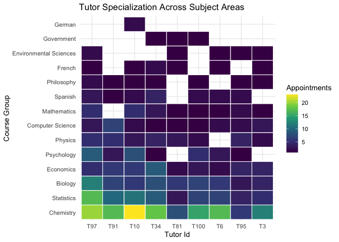

# README
Valeria Escrich

## Data

This project uses St. Lawrence University Peer Tutoring Program
appointment data. The dataset includes information on tutor and student
IDs, course subjects, appointment times, class year, location, and form
completion time.

The data was cleaned and structures by grouping courses into broader
subject areas, making student and tutor names anonymous, and modifying
class years. Some variables,such as location, were expluded from the
analysis due to lack of reliable variables.

## Questions

This project explores peer tutoring program functions from both tutors
and student perspectives:

- Is tutoring workload evenly distributed across tutors?
- Do a small number of tutors handle most appointments?
- Do students return to the same tutor over time?
- When are tutoring appointments most likely to occur?
- How do student characteristics, such as class year, influence tutoring
  usage?

## Tutor Specialization Across Subject Areas

This figure highlights how tutoring appointments are distributed across
subject areas from the most active tutors, showing patterns of
specialization and demand. This project goes over this content and more
in detail explanations of how the program is shaped by students.

